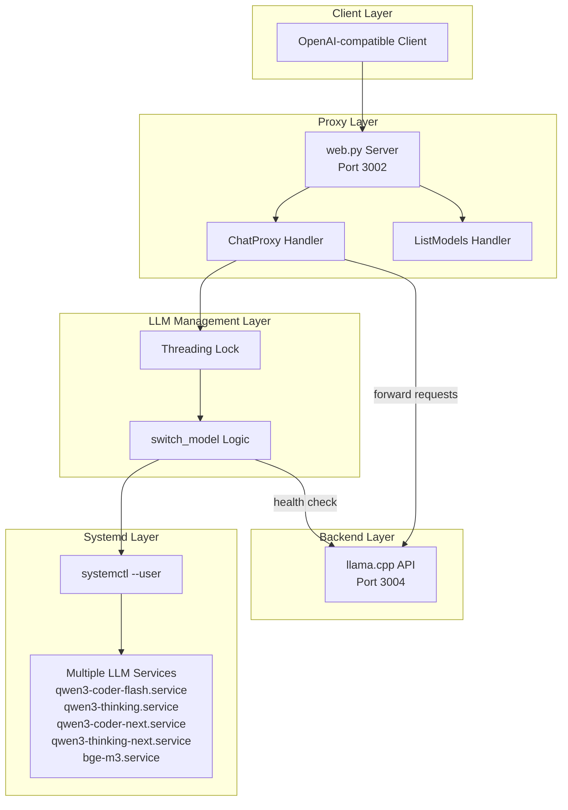

# Systemd LLM Switch

This project provides a robust **systemd-based** solution for managing local Large Language Models (LLMs) on Linux systems. It enables dynamic switching between models (Coder, Thinking, Embedding) via an intelligent Python proxy, which is crucial for efficient usage of limited VRAM.

## 🚀 Why This Project Exists

Running 30B+ parameter models on consumer hardware requires precise memory management. This project is optimized for systems with **8GB VRAM**, where running multiple large models simultaneously is impossible.

### Key Benefits:

* **VRAM Optimization**: Automatically stops unused models before starting a new one, preventing Out of Memory (OOM) crashes.
* **Roo Code (IDE Integration)**: Perfect for developers. Use the **Thinking** model for architectural planning and logic, then instantly switch to the **Coder** model for the actual implementation.
* **Open WebUI**: Functions as a backend that appears in the UI as a single OpenAI-compatible connection with multiple available models.

---

## 💻 Hardware Requirements

| Component | Minimum Requirement |
| --- | --- |
| **System RAM** | 64GB (to hold the offloaded parts of the model) |
| **VRAM (GPU)** | 8GB (NVIDIA CUDA compatible) |
| **Storage** | 100GB+ free space on SSD (for fast model loading) |

> [!TIP]
> Models run in **split-layer mode**. The configuration uses `--n-gpu-layers 49` and specific `override-tensor` instructions to force Mixture of Experts (MoE) calculations to the CPU, ensuring 30B models fit into 8GB VRAM.

---

## 🏗️ System Architecture

The system consists of three layers:

1. **Systemd Services**: Individual `llama-server` instances for each model.
2. **Python Proxy (Port 3002)**: The "brain" that receives API requests, controls systemd, and forwards queries.
3. **Backend (Port 3004)**: The currently active model instance.



---

## 🛠️ Installation & Setup

### 1. Build llama.cpp (Required)

You need `llama.cpp` installed on your system. If you haven't built it yet, follow these steps:

```bash
# Clone llama.cpp repository
git clone https://github.com/ggml-org/llama.cpp.git
cd llama.cpp

# Configure and build with CUDA support
mkdir build && cd build
cmake .. -DGGML_CUDA=ON
cmake --build . --config Release -j $(nproc)
```

### 2. Download Models

You can use the `llama-server` command to download the recommended GGUF models directly from Hugging Face. These versions are optimized for the memory management used in this project:

```bash
# Qwen3 Coder Next (80B) - UD-Q4_K_XL
llama-server -hf unsloth/Qwen3-Coder-Next-GGUF:UD-Q4_K_XL

# Qwen3 Coder Flash 30B - UD-Q8_K_XL
llama-server -hf unsloth/Qwen3-Coder-30B-A3B-Instruct-GGUF:UD-Q8_K_XL

# Qwen3 Thinking Next (80B) - UD-Q4_K_XL
llama-server -hf unsloth/Qwen3-Next-80B-A3B-Thinking-GGUF:UD-Q4_K_XL

# Qwen3 Thinking 30B - UD-Q8_K_XL
llama-server -hf unsloth/Qwen3-30B-A3B-Thinking-2507-GGUF:UD-Q8_K_XL

# BGE-M3 Embedding - bge-m3-q8_0
llama-server -hf ggml-org/bge-m3-Q8_0-GGUF:bge-m3-q8_0.gguf
```

### 3. Clone & Run Setup

The setup script is now fully automated and interactive. It will:
- Create a virtual environment and install Python dependencies.
- **Ask for the path to your `llama-server` binary** (defaulting to `~/llama.cpp/build/bin/llama-server`).
- **Ask for your models directory** (defaulting to `~/.cache/llama.cpp`).
- Dynamically patch all systemd service files with the correct paths.
- Link the services to your user-level systemd directory.

```bash
# Clone this repository
git clone https://github.com/ladislav-danis/systemd-llm-switch.git
cd systemd-llm-switch

# Run the setup
chmod +x setup.sh
./setup.sh
```

During setup, you will see prompts like this:
- `📂 Path to your llama-server binary [default: /home/user/llama.cpp/build/bin/llama-server]:`
- `📂 Directory where your GGUF models are stored [default: /home/user/.cache/llama.cpp]:`

---

## ⚙️ Model Configuration (`config.yaml`)

The system is designed to be easily extensible. You can manage which models are available to your clients by editing `src/systemd_llm_switch/config.yaml`.

### Adding a New Model

1.  **Create a systemd service**: Create a new `.service` file in `deploy/systemd/` (you can use existing ones as a template).
2.  **Run setup**: Run `./setup.sh` again to link the new service and update paths.
3.  **Update `config.yaml`**: Add the new model ID and its corresponding service name to the `models` section.

Default `config.yaml` from this repository:

```yaml
models:
  qwen3-coder-flash: "qwen3-coder-flash.service"
  qwen3-coder-next: "qwen3-coder-next.service"
  bge-m3: "bge-m3.service"
  # You can also add these if you have them downloaded:
  # qwen3-thinking: "qwen3-thinking.service"
  # qwen3-thinking-next: "qwen3-thinking-next.service"
```

### Removing a Model

To remove a model, simply delete or comment out its line in the `models` section of `config.yaml`. The proxy will immediately stop recognizing that model ID.

---

## 🚀 Performance & Optimization

### VRAM & Offloading

The default configuration is highly optimized for **8GB VRAM** systems using a split-layer MoE (Mixture of Experts) approach.

*   **Default Behavior**: It uses `--n-gpu-layers 49` and a specific `--override-tensor` regex to force heavy MoE calculations to the CPU, keeping the model within 8GB VRAM.
*   **High-End Systems**: If you have more VRAM (e.g., 12GB, 16GB, or 24GB), you should:
    1.  **Adjust the regex**: Modify the `override-tensor` pattern in the `.service` files to allow more experts to stay on the GPU (reducing CPU offloading).
    2.  **Monitor with `nvtop`**: Use `nvtop` to watch VRAM usage in real-time while adjusting parameters to find the perfect balance between speed and memory limits.

*If there is interest, I can also provide tuned configurations for **16 GB, 24GB, or 32GB (2x16GB)** setups.*

---

## ✨ Features

### 🛠️ Targeted JSON Repair
The proxy includes an integrated **JSON repair mechanism** using the [`json-repair`](https://github.com/joakim-lydell/json-repair) library. This is specifically tuned to handle malformed JSON in **tool call arguments**, which can occur with smaller models or high quantization levels.

*   **Tool call arguments repair**: Automatically repairs JSON in tool call function arguments to ensure clients receive valid structures.
*   **Safe content handling**: The main message content is **never** modified by the repair logic, ensuring that code blocks, prose, and intentional formatting remain exactly as the model generated them.

### 🏛️ OpenAI Standard Compliance
To ensure maximum compatibility with strict OpenAI-compatible clients (like Aider, Cursor, or Cline):
*   **Null Content**: When a model initiates a `tool_calls` response, the `content` field is explicitly set to `null` instead of an empty string, adhering to the OpenAI API specification.
*   **Structured Output**: All internal transformations are designed to maintain a valid OpenAI-compatible JSON schema even when the backend provides slightly irregular outputs.

### ⚡ Forced Non-Streaming
To ensure the JSON repair logic can always process the full response, the proxy **forces `stream=False`** for all requests. This ensures maximum reliability for IDE integrations (like Roo Code) that depend on valid JSON structures for tool calling and structured data.

The implementation uses a threading lock ([`threading.Lock()`](src/systemd_llm_switch/main.py:84)) to prevent VRAM race conditions when switching between models.

---

## ⚙️ Service Management

The project utilizes `systemd --user`, so it does not require root privileges for daily operation.

| Service | Purpose | Model |
| --- | --- | --- |
| `llm-switch.service` | Main Proxy Server | `main.py` |
| `qwen3-coder-flash.service` | Coding & Syntax | Qwen3-Coder-30B (Q8_K_XL) |
| `qwen3-coder-next.service` | Coding & Syntax | Qwen3-Coder-80B (Q4_K_XL) |
| `qwen3-thinking.service` | Logic & Planning | Qwen3-Thinking-30B (Q8_K_XL) |
| `qwen3-thinking-next.service` | Logic & Planning | Qwen3-Thinking-80B (Q4_K_XL) |
| `bge-m3.service` | Vector Search (RAG) | BGE-M3 (Q8_0) |

**Basic Commands:**

```bash
# Monitor proxy logs (including model switching)
journalctl --user -u llm-switch.service -f

# Manually stop models (to free VRAM for gaming or other work)
systemctl --user stop qwen3-coder-flash.service qwen3-coder-next.service qwen3-thinking.service qwen3-thinking-next.service bge-m3.service
```

---

## 🧪 Testing

The project includes a test suite to verify correct setup:

* **Unit Tests**: Run `./run_tests.sh` to execute the unit tests and verify the integrity of the Python code.
* **Smoke Test**: Execute `python3 tests/test_smoke.py` to perform a real request to the proxy and verify the model starts and responds correctly.

### Running Tests

```bash
# Run all tests
./run_tests.sh

# Run only the smoke test
python3 tests/test_smoke.py
```

The smoke test will:
1. Start the proxy server
2. Make a test request to list available models
3. Attempt to switch to a model and make a chat completion request
4. Verify the response is valid JSON

---

## 🔗 Integrations

### Roo Code (Setup Example)

* **Provider**: OpenAI Compatible
* **Base URL**: `http://localhost:3002/v1`
* **Model ID**: `qwen3-coder-flash`, `qwen3-coder-next`, or `bge-m3` (and others if configured in `config.yaml`)
* **Context Window**: 32768 (30B-A3B) , 65536 (80B-A3B)

### Open WebUI

Add a new OpenAI connection with the URL `http://localhost:3002/v1`.

### Models download llama.cpp command
`llama-server -hf unsloth/Qwen3-Coder-Next-GGUF:UD-Q4_K_XL`

## 🗺️ Repository Structure

```
systemd-llm-switch/
├── AGENTS.md
├── LICENSE.md
├── README.md
├── requirements.txt
├── setup.sh
├── run_tests.sh
├── test_requirements.txt
├── deploy/
│   └── systemd/
│       ├── bge-m3.service
│       ├── llm-switch.service
│       ├── qwen3-coder-flash.service
│       ├── qwen3-coder-next.service
│       ├── qwen3-thinking-next.service
│       └── qwen3-thinking.service
├── src/
│   ├── __init__.py
│   └── systemd_llm_switch/
│       ├── __init__.py
│       ├── config.yaml
│       └── main.py
└── tests/
    ├── __init__.py
    ├── test_main.py
    └── test_smoke.py
```

**Descriptions:**
- `deploy/systemd/`: Contains systemd service files for each model instance.
- `src/`: Root source directory with package initialization.
- `src/systemd_llm_switch/`: Main application code (config, proxy logic).
- `tests/`: Test suite for validation.

---

## 🛠️ Troubleshooting

### Common Issues

#### Model fails to start
**Symptoms**: Request times out or returns "Model X did not start on time"

**Solutions**:
1. Check if the model file exists in your models directory
2. Verify the service file paths point to the correct `llama-server` binary
3. Check logs with `journalctl --user -u <service-name>.service -f`
4. Ensure sufficient VRAM is available (stop other models first)

#### Service not found
**Symptoms**: `Failed to activate model X` error

**Solutions**:
1. Run `./setup.sh` to ensure services are properly linked
2. Verify the service file exists in `~/.config/systemd/user/`
3. Check that the model ID in your request matches an entry in `config.yaml`

#### VRAM overflow
**Symptoms**: `llama-server` crashes or OOM killer terminates the process

**Solutions**:
1. Stop all models with `systemctl --user stop qwen3-*.service bge-m3.service`
2. Adjust the `--n-gpu-layers` and `--override-tensor` parameters in your service files
3. For 8GB VRAM systems, ensure you're using the optimized configuration with MoE offloading

#### Connection refused
**Symptoms**: `Connection refused` when trying to reach the proxy

**Solutions**:
1. Ensure the proxy service is running: `systemctl --user status llm-switch.service`
2. Check if the proxy is listening on port 3002: `netstat -tuln | grep 3002`
3. Restart the proxy service: `systemctl --user restart llm-switch.service`

### Debug Mode

To enable more verbose logging, modify the logging level in [`src/systemd_llm_switch/main.py`](src/systemd_llm_switch/main.py:21):

```python
logging.basicConfig(
    level=logging.DEBUG,  # Changed from INFO to DEBUG
    format='%(asctime)s - %(levelname)s - %(message)s',
    stream=sys.stdout
)
```

### Getting Help

If you encounter issues not covered here, please check:
1. The systemd logs: `journalctl --user -u llm-switch.service -f`
2. The model-specific logs: `journalctl --user -u qwen3-coder-flash.service -f`
3. Ensure `loginctl enable-linger $USER` is set to keep services running after logout