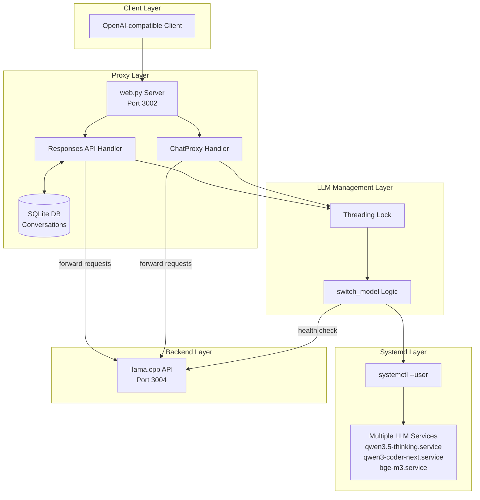

# Systemd LLM Switch

This project provides a robust **systemd-based** solution for managing local Large Language Models (LLMs) on Linux systems. It enables dynamic switching between models (Coder, Thinking, Embedding) via an intelligent Python proxy, which is crucial for efficient usage of limited VRAM.

## 🚀 Why This Project Exists

Running 30B+ parameter models on consumer hardware requires precise memory management. This project is optimized for systems with **8GB VRAM**, where running multiple large models simultaneously is impossible.

### Key Benefits:

* **VRAM Optimization**: Automatically stops unused models before starting a new one, preventing Out of Memory (OOM) crashes.
* **Roo Code (IDE Integration)**: Perfect for developers. Use the **Thinking** model for architectural planning and logic, then instantly switch to the **Coder** model for the actual implementation.
* **Open WebUI**: Functions as a backend that appears in the UI as a single OpenAI-compatible connection with multiple available models.
* **OpenAI Responses API**: Full compatibility with the modern, stateful [OpenAI Responses API](https://developers.openai.com/api/reference/resources/responses/), including conversation persistence and advanced tool calling.

---

## 🏗️ System Architecture

The system consists of three layers:

1. **Systemd Services**: Individual `llama-server` instances for each model.
2. **Python Proxy (Port 3002)**: The "brain" that receives API requests, controls systemd, manages SQLite persistence, and forwards queries.
3. **Backend (Port 3004)**: The currently active model instance.


```mermaid
flowchart TD
    subgraph "Client Layer"
        Client[OpenAI-compatible Client]
    end
    
    subgraph "Proxy Layer"
        WebPy[web.py Server<br/>Port 3002]
        ChatProxy[ChatProxy Handler]
        ResponsesHandler[Responses API Handler]
        SQLite[(SQLite DB<br/>Conversations)]
    end
    
    subgraph "LLM Management Layer"
        Lock[Threading Lock]
        Switcher[switch_model Logic]
    end
    
    subgraph "Systemd Layer"
        Systemctl[systemctl --user]
        Services[Multiple LLM Services<br/>qwen3.5-thinking.service<br/>qwen3-coder-next.service<br/>bge-m3.service]
    end
    
    subgraph "Backend Layer"
        Llama[llama.cpp API<br/>Port 3004]
    end
    
    Client --> WebPy
    WebPy --> ChatProxy
    WebPy --> ResponsesHandler
    ResponsesHandler <--> SQLite
    ChatProxy --> Lock
    ResponsesHandler --> Lock
    Lock --> Switcher
    Switcher --> Systemctl
    Systemctl --> Services
    Switcher -->|health check| Llama
    ChatProxy -->|forward requests| Llama
    ResponsesHandler -->|forward requests| Llama
```

---

## 🛠️ Installation & Setup

### 1. Build llama.cpp (Required)

You need `llama.cpp` installed on your system. If you haven't built it yet, follow these steps:

```bash
# Clone llama.cpp repository
git clone https://github.com/ggml-org/llama.cpp.git
cd llama.cpp

# Configure and build with CUDA support
mkdir build && cd build
cmake .. -DGGML_CUDA=ON
cmake --build . --config Release -j $(nproc)
```

### 2. Download Models

You can use the `llama-server` command to download the recommended GGUF models directly from Hugging Face. These versions are optimized for the memory management used in this project:

```bash
# Qwen3.5 Thinking 35B (Recommended for logic & architecture)
llama-server -hf unsloth/Qwen3.5-35B-A3B-GGUF:UD-Q4_K_XL

# Qwen3 Coder Next (80B) - UD-Q4_K_XL (Recommended for implementation)
llama-server -hf unsloth/Qwen3-Coder-Next-GGUF:UD-Q4_K_XL

# BGE-M3 Embedding - bge-m3-q8_0
llama-server -hf ggml-org/bge-m3-Q8_0-GGUF:bge-m3-q8_0.gguf
```

### 3. Clone & Run Setup

The setup script is now fully automated and interactive. It will:
- Create a virtual environment and install Python dependencies.
- **Ask for the path to your `llama-server` binary** (defaulting to `~/llama.cpp/build/bin/llama-server`).
- **Ask for your models directory** (defaulting to `~/.cache/llama.cpp`).
- Dynamically patch all systemd service files with the correct paths.
- Link the services to your user-level systemd directory.

```bash
# Clone this repository
git clone https://github.com/ladislav-danis/systemd-llm-switch.git
cd systemd-llm-switch

# Run the setup
chmod +x setup.sh
./setup.sh
```

---

## ⚙️ Model Configuration (`config.yaml`)

The system is designed to be easily extensible. You can manage which models are available to your clients by editing `src/systemd_llm_switch/config.yaml`.

Default `config.yaml` from this repository:

```yaml
models:
  qwen3.5-thinking: "qwen3.5-thinking.service"
  qwen3-coder-next: "qwen3-coder-next.service"
  bge-m3: "bge-m3.service"
```

---

## ✨ Features

### 🏛️ 100% OpenAI Responses API Compatibility
The proxy now fully supports the modern, stateful [Responses API](https://developers.openai.com/api/reference/resources/responses/):
*   **Conversation Persistence**: Uses a local SQLite database to store chat history, enabling `conversation_id` functionality.
*   **Context Branching**: Supports `previous_response_id` for creating parallel conversation branches with precise context isolation.
*   **Unified Endpoints**: Implements `/v1/responses`, `/v1/responses/{id}`, `/v1/responses/{id}/items`, and `/v1/responses/{id}/cancel`.
*   **Advanced Parameter Support**: Full support for `instructions` (automatically converted to System Messages) and `metadata`.
*   **Modern Schema**: Translates between the flattened Responses API tool definitions and the nested Chat Completions backend.

### 🛠️ Targeted JSON Repair
The proxy includes an integrated **JSON repair mechanism** using the [`json-repair`](https://github.com/joakim-lydell/json-repair) library. This is specifically tuned to handle malformed JSON in **tool call arguments**, which can occur with smaller models or high quantization levels.

*   **Tool call arguments repair**: Automatically repairs JSON in tool call function arguments across both Chat Completions and Responses API.
*   **Safe content handling**: The main message content is **never** modified by the repair logic.

### 🔌 Advanced Tool Calling Support
*   **Parallel Tool Execution**: Supports multiple tool calls in a single model turn.
*   **Stream Simulation**: For both APIs, the proxy provides OpenAI-compliant SSE streams even when the backend processing is synchronous, ensuring compatibility with all client types.

### 🏛️ OpenAI Standard Compliance
*   **Null Content**: Correctly sets `content: null` during tool calls.
*   **Standard SSE Events**: The Responses API stream emits standard events like `response.created`, `response.output_item.added`, and `response.completed`.

---

## ⚙️ Service Management

| Service | Purpose | Model |
| --- | --- | --- |
| `llm-switch.service` | Main Proxy Server | `main.py` |
| `qwen3.5-thinking.service` | Logic & Planning | Qwen3.5-Thinking-35B (Q4_K_XL) |
| `qwen3-coder-next.service` | Coding & Syntax | Qwen3-Coder-80B (Q4_K_XL) |
| `bge-m3.service` | Vector Search (RAG) | BGE-M3 (Q8_0) |

---

## 🧪 Testing

The project includes a test suite to verify correct setup:

```bash
# Run all unit tests (includes Responses API and SQLite tests)
./run_tests.sh

# Run real-proxy integration tests (proxy must be running)
./.venv/bin/python3 -m unittest tests/test_integration_real_proxy.py -v
```

---

## 🗺️ Repository Structure

```
systemd-llm-switch/
├── deploy/
│   └── systemd/                # Systemd service templates
├── src/
│   └── systemd_llm_switch/
│       ├── db.py               # SQLite persistence logic
│       ├── main.py             # Main proxy and API handlers
│       └── config.yaml         # Model mapping configuration
└── tests/                      # Comprehensive test suite
```
